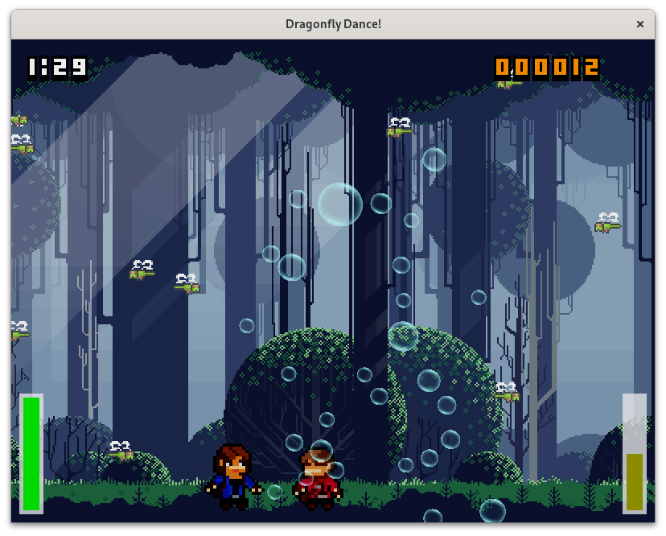

# Dragonfly Dance

Take part in the delicate dance between dragonflies and shivering shimmering
bubbles.



## Build

### GNU/Linux

Install the following (development) packages with the package manager of your
choice:

 - SDL2
 - SDL2_image
 - SDL2_mixer
 - GLEW
 - CMake
 - Python3

Build the project using the following commands:

```bash
mkdir build && cd build
cmake ..
cmake --build .
```

### Windows

Use the prefix package from [here](https://github.com/leftoverspecs/prefix/releases)
in order to get all the necessary third party packages. Install the following
software:

 - CMake
 - Python3
 - Visual Studio C++ (Community Edition)

Build the project using the following commands:

```cmd
mkdir build
cd build
cmake -DCMAKE_PREFIX_PATH=<Path to prefix package> ..
cmake --build .
```

In order to run the game you need to copy the following libraries next to the
executable:

 - glew32.dll
 - SDL2.dll
 - SDL2_image.dll
 - SDL2_mixer.dll
